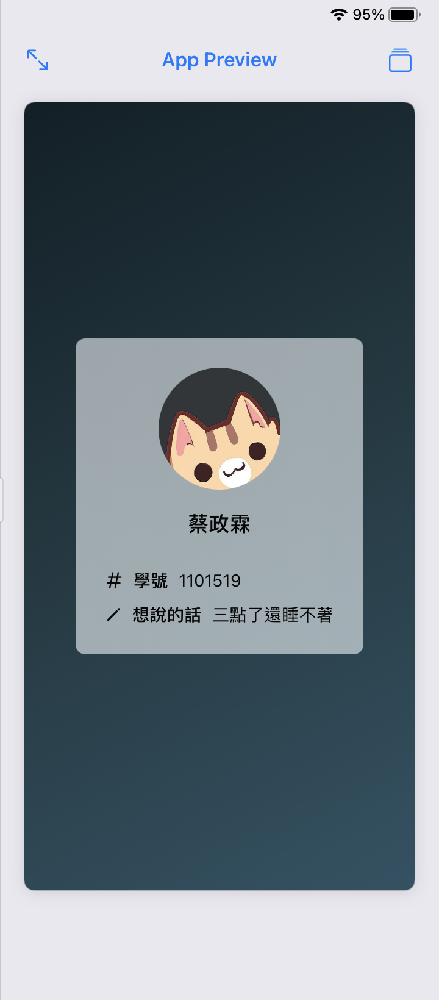

# 作業一

## 截圖


## 程式碼
```swift
import SwiftUI

extension Color {
    private static let hexPattern = #"^#[\da-fA-F]{6}$"#
    
    static func fromHex(_ hex: String) -> Color? {
        let range = hex.range(of: Self.hexPattern, options: .regularExpression, range: nil, locale: nil)
        if (range == nil) {
            return nil
        }
        let rawR = hex.index(hex.startIndex, offsetBy: 1)...hex.index(hex.startIndex, offsetBy: 2)
        let rawG = hex.index(hex.startIndex, offsetBy: 3)...hex.index(hex.startIndex, offsetBy: 4)
        let rawB = hex.index(hex.startIndex, offsetBy: 5)...hex.index(hex.startIndex, offsetBy: 6)
        let r = Double(Int(hex[rawR], radix: 16)!) / 255.0
        let g = Double(Int(hex[rawG], radix: 16)!) / 255.0
        let b = Double(Int(hex[rawB], radix: 16)!) / 255.0
        return self.init(uiColor: UIColor(red: r, green: g, blue: b, alpha: 1))
    }
}

struct ContentView: View {
    static let colors =  [Color.fromHex("#0f2027")!, Color.fromHex("#203a43")!, Color.fromHex("#2c5364")!]
    
    var body: some View {
        ZStack {
            LinearGradient(
                colors: Self.colors,
                startPoint: .topLeading,
                endPoint: .bottomTrailing
            )
            VStack {
                Image("profile.jpg")
                    .resizable(capInsets: EdgeInsets(), resizingMode: .stretch)
                    .frame(width: 100, height: 100, alignment: .center)
                    .cornerRadius(50, antialiased: true)
                    .padding(.bottom, 10)
                Text("蔡政霖")
                    .font(.title3)
                    .fontWeight(.medium)
                    .padding(.bottom, 20)
                VStack(alignment: .leading) {
                    HStack {
                        Image(systemName: "number")                    
                        Text("學號")                    
                            .fontWeight(.medium)
                        Text("1101519")
                    }
                    .padding(.bottom, 4)
                    HStack {
                        Image(systemName: "pencil")                    
                        Text("想說的話")                    
                            .fontWeight(.medium)
                        Text("三點了還睡不著")
                    }
                }
            }
            .padding(24)
            .background(.thinMaterial)
            .cornerRadius(8, antialiased: true)
        }.ignoresSafeArea()
    }
}
```
