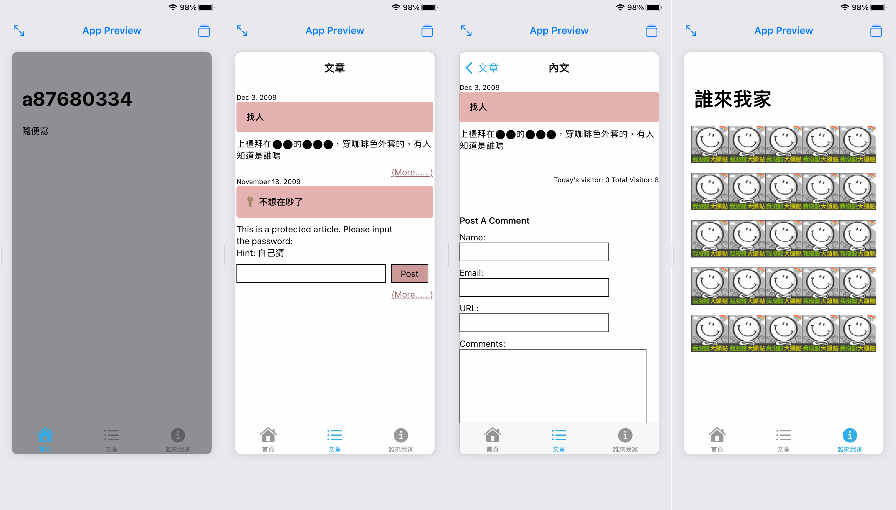

# 作業四

## 截圖


## 程式碼
```swift
import SwiftUI

struct HomeView: View {
    var body: some View {
        NavigationView {
            VStack {
                HStack {
                    Text("隨便寫")
                    Spacer()
                }
                .padding()
                Spacer()
            }
            .navigationTitle("a87680334")
            .background(Color.gray)
        }
        .navigationViewStyle(.stack)
    }
}

struct ItemView: View {
    let date: String
    let title: String
    var hint: String? = nil
    var desc: String? = nil
    var hideMore: Bool = false
    var body: some View {
        VStack(alignment: .leading, spacing: 0) {
            Text(date)
                .font(.caption)
            VStack {
                HStack(spacing: 8) {
                    if let _ = hint {
                        Image(systemName: "key.fill")
                            .foregroundStyle(.brown)
                    }
                    Text(title)
                        .font(.headline)
                    Spacer()
                }
                .padding()
            }
            .background(Color(red: 0.9, green: 0.7, blue: 0.7))
            .cornerRadius(4)
            Rectangle()
                .fill(.clear)
            if let hint = hint {
                HStack {
                    Text("This is a protected article. Please input the password:\nHint: \(hint)")
                    Spacer()
                }
                Rectangle()
                    .fill(.clear)
                HStack {
                    Rectangle()
                        .fill(.clear)
                        .border(.primary)
                        .frame(width: 240, height: 30)
                    Text("Post")
                        .frame(width: 60, height: 30)
                        .background(Color(red: 0.8, green: 0.6, blue: 0.6))
                        .border(.primary)
                    Spacer()
                }   
            } else {
                Text(desc ?? "")
            }
            if hideMore {
                Group {
                    Rectangle()
                        .fill(.clear)
                        .frame(height: 40)
                    HStack {
                        Spacer()
                        Text("Today's visitor: 0 Total Visitor: 8")
                            .font(.caption)
                    }
                    Rectangle()
                        .fill(.clear)
                        .frame(height: 40)
                    Rectangle()
                        .fill(.clear)
                    Text("Post A Comment")
                        .font(.headline)
                    Rectangle()
                        .fill(.clear)
                    Text("Name: ")
                    Rectangle()
                        .fill(.clear)
                        .border(.primary)
                        .frame(width: 240, height: 30)
                }
                Group {
                    Rectangle()
                        .fill(.clear)
                    Text("Email: ")
                    Rectangle()
                        .fill(.clear)
                        .border(.primary)
                        .frame(width: 240, height: 30)
                    Rectangle()
                        .fill(.clear)
                }
                Group {
                    Text("URL: ")
                    Rectangle()
                        .fill(.clear)
                        .border(.primary)
                        .frame(width: 240, height: 30)
                    Rectangle()
                        .fill(.clear)
                    Text("Comments: ")
                    Rectangle()
                        .fill(.clear)
                        .border(.primary)
                        .frame(width: 300, height: 400)
                    Rectangle()
                        .fill(.clear)
                }
            } else {
                Rectangle()
                    .fill(.clear)
                HStack {
                    Spacer()
                    NavigationLink {
                        ScrollView {
                            ItemView(date: date, title: title, desc: desc, hideMore: true)
                            Spacer()
                        }
                        .navigationTitle("內文")
                        .navigationBarTitleDisplayMode(.inline)
                    } label: {
                        Text("(More......)")
                            .underline()
                            .tint(Color(red: 0.6, green: 0.4, blue: 0.4))
                    }
                }
            }
        }
    }
}

struct ItemListView: View {
    var body: some View {
        NavigationView {
            ScrollView {
                VStack {
                    ItemView(date: "Dec 3, 2009", title: "找人", desc: "上禮拜在⬤⬤的⬤⬤⬤，穿咖啡色外套的，有人知道是誰嗎")
                    ItemView(date: "November 18, 2009", title: "不想在吵了", hint: "自己猜")
                }.padding()
            }
            .navigationTitle("文章")
            .navigationBarTitleDisplayMode(.inline)
        }
        .navigationViewStyle(.stack)
    }
}

struct VisitorView: View {
    private let columns: [GridItem] = [
        .init(.flexible()),
        .init(.flexible()),
        .init(.flexible()),
        .init(.flexible()),
        .init(.flexible())
    ]
    var body: some View {
        NavigationView {
            ScrollView {
                LazyVGrid(columns: columns, spacing: 16) {
                    ForEach(0..<25, id: \.self) { _ in
                        Image("no_avatar")
                            .resizable()
                            .frame(width: 60, height: 60)
                    }
                }
                .padding(16)
            }.navigationTitle("誰來我家")
        }
        .navigationViewStyle(.stack)
    }
}

struct ContentView: View {
    @State private var selection = 2
    var body: some View {
        TabView(selection: $selection) {
            HomeView()
                .tabItem {
                    Image(systemName: "house")
                    Text("首頁")
                }
                .tag(1)
            ItemListView()
                .tabItem {
                    Image(systemName: "list.bullet")
                    Text("文章")
                }
                .tag(2)
            VisitorView()
                .tabItem {
                    Image(systemName: "info.circle")
                    Text("誰來我家")
                }
                .tag(3)
        }
    }
}
```
